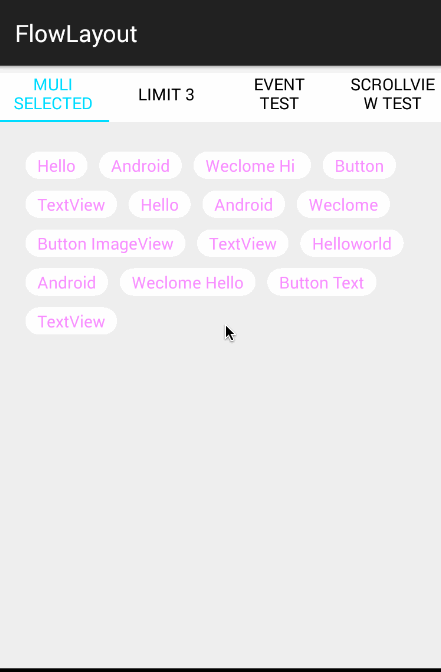
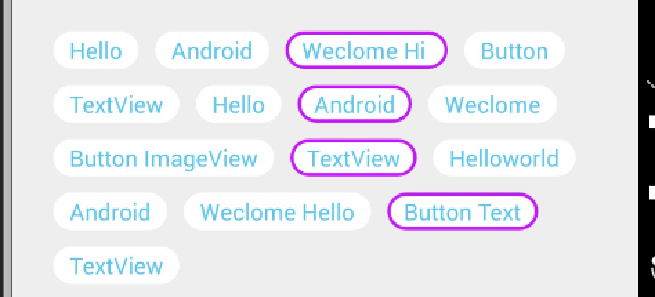

[](http://www.android-gems.com/lib/hongyangAndroid/FlowLayout)

# FlowLayout
Android流式布局，支持单选、多选等，适合用于产品标签等。


##特色
* 以setAdapter形式注入数据
* 直接设置selector为background即可完成标签选则的切换，类似CheckBox
* 支持控制选择的Tag数量，比如：单选、多选
* 支持setOnTagClickListener，当点击某个Tag回调
* 支持setOnSelectListener，当选择某个Tag后回调
* 支持adapter.notifyDataChanged
* Activity重建（或者旋转）后，选择的状态自动保存

##效果图





## 用法

```java
dependencies {
 compile 'com.hyman:flowlayout-lib:1.1.2'
}
```

### 声明
布局文件中声明：

```java
 <com.zhy.view.flowlayout.TagFlowLayout
        android:id="@+id/id_flowlayout"
        zhy:max_select="-1"
        android:layout_width="fill_parent"
        android:layout_height="wrap_content"
        android:padding="20dp">
    </com.zhy.view.flowlayout.TagFlowLayout>
```

支持属性：

`max_select`：-1为不限制选择数量，>=1的数字为控制选择tag的数量

支持通过state=checked来控制选中和取消,也可以自己在Adapter
的onSelected和unSelected中分别处理显示。

###设置数据

```java
mFlowLayout.setAdapter(new TagAdapter<String>(mVals)
   {
       @Override
       public View getView(FlowLayout parent, int position, String s)
       {
           TextView tv = (TextView) mInflater.inflate(R.layout.tv,
                   mFlowLayout, false);
           tv.setText(s);
           return tv;
       }
   });
```


getView中回调，类似ListView等用法。

### 对于选中状态

```java
<?xml version="1.0" encoding="utf-8"?>
<selector xmlns:android="http://schemas.android.com/apk/res/android">
    <item android:color="@color/tag_select_textcolor"
          android:drawable="@drawable/checked_bg"
          android:state_checked="true"></item>
    <item android:drawable="@drawable/normal_bg"></item>
</selector>

```

设置个background，上面一个状态为android:state_checked，另一个为正常。写写布局文件我都嫌慢，怎么能写一堆代码控制效果，设置改个效果，岂不是没时间dota了。


也可以不依赖state_checked,在下面的回调中自行设置:

```
#Adapter
@Override
public void onSelected(int position, View view) {
    super.onSelected(position, view);
}

@Override
public void unSelected(int position, View view) {
    super.unSelected(position, view);
}
```


###事件

```java
mFlowLayout.setOnTagClickListener(new TagFlowLayout.OnTagClickListener()
{
  @Override
  public boolean onTagClick(View view, int position, FlowLayout parent)
  {
      Toast.makeText(getActivity(), mVals[position], Toast.LENGTH_SHORT).show();
      return true;
  }
});
```

点击标签时的回调。

```java
mFlowLayout.setOnSelectListener(new TagFlowLayout.OnSelectListener()
{
  @Override
  public void onSelected(Set<Integer> selectPosSet)
  {
      getActivity().setTitle("choose:" + selectPosSet.toString());
  }
});
```
选择多个标签时的回调。

##预先设置Item选中

```java
//预先设置选中
mAdapter.setSelectedList(1,3,5,7,8,9);
//获得所有选中的pos集合
flowLayout.getSelectedList();
```


